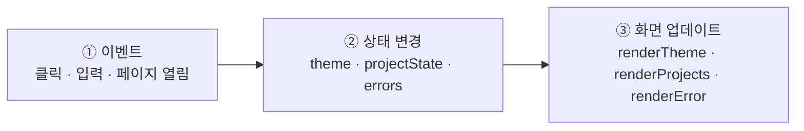
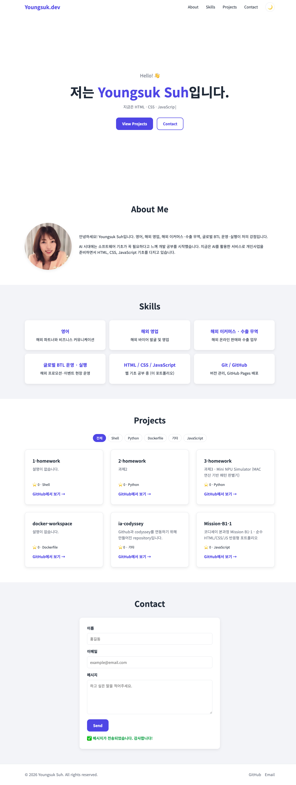
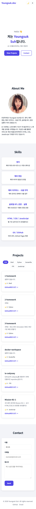
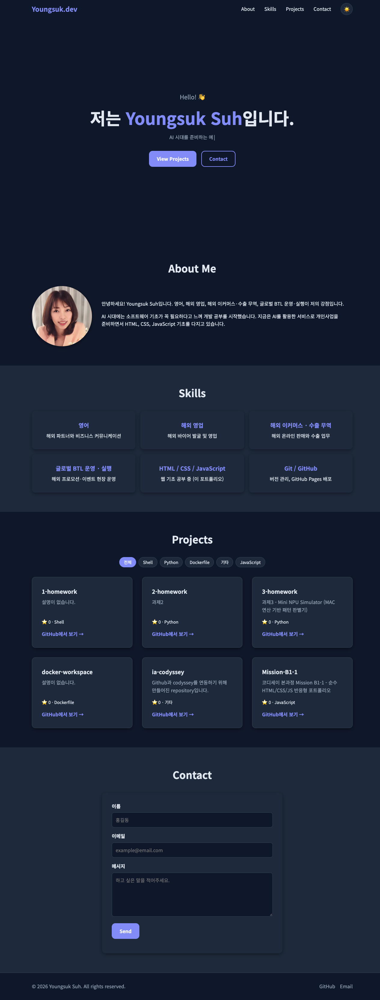

# Mission B1-1 · 나를 소개하는 웹페이지 처음부터 만들기

> 코디세이 AI/SW 기초 · 웹 기초와 프론트엔드 · 필수 미션
> 만든 사람: **Youngsuk Suh** ([@ellysuh22](https://github.com/ellysuh22))

외부 라이브러리 없이 **순수 HTML · CSS · JavaScript**만으로 만든 반응형 자기소개(포트폴리오) 웹사이트입니다.
화면을 예쁘게 그리는 것보다 **"사용자 이벤트 → 상태 변경 → 화면 업데이트"** 가 어떻게 이어지는지 직접 구현하고 설명할 수 있는 것을 목표로 했습니다.

| 제출물 | 링크 |
| --- | --- |
| 🌐 배포 사이트 (GitHub Pages) | https://ellysuh22.github.io/Mission-B1-1/ |
| 📁 GitHub 저장소 | https://github.com/ellysuh22/Mission-B1-1 |
| 🖼 스크린샷 (데스크톱 · 모바일 · 다크 모드) | [아래 스크린샷 섹션](#-스크린샷) · [`images/screenshots/`](images/screenshots/) |


## 🧭 이 미션, 이렇게 봐주세요 (3단계)

이 미션은 **도구(React 등)의 도움 없이 HTML · CSS · JavaScript만으로** 웹사이트를 처음부터 끝까지 만들어 보는 과제입니다.
화면을 예쁘게 만드는 것보다 **"사용자가 무언가 하면(이벤트) → 값이 바뀌고(상태) → 화면이 다시 그려진다(렌더링)"** 는 웹의 동작 원리를 직접 손으로 구현하고 설명하는 것이 목적입니다.
그래서 아래 **① 결과물 → ② 왜 · 무엇을 배웠는지 → ③ 평가 문항별 답변** 순서로 보시면 됩니다.

| 순서 | 무엇 | 링크 | 여기서 볼 수 있는 것 |
| --- | --- | --- | --- |
| **①** | **결과물 — 자기소개 웹페이지** | 🌐 [배포 사이트 열기](https://ellysuh22.github.io/Mission-B1-1/) · 📄 [index.html 코드 보기](index.html) | 반응형 레이아웃, 다크 모드, 햄버거 메뉴, GitHub 프로젝트 목록, 문의 폼이 실제로 동작하는 화면 |
| **②** | **과제 목표 — 왜 이 미션을 하나요** | 📘 [아래 "이 미션은 왜 하나요?"](#-이-미션은-왜-하나요) · [공부할 것](#-이-미션에서-공부할-것) | 미션의 목적 4가지, 과제 목표 6개, 공부 순서 |
| **③** | **평가 항목 — 요구사항별 확인** | 📝 [평가자를 위한 빠른 확인 가이드](#-평가자를-위한-빠른-확인-가이드) · [요구사항 ↔ 구현 위치](#-요구사항--구현-위치) | 3분 시연 순서, 요구사항마다 해당 코드 줄로 가는 링크 |

> 💡 **설명 흐름 예시** — "① 먼저 완성된 사이트를 보여 드리고 → ② 이 미션이 왜 필요한지와 무엇을 배웠는지 말씀드린 뒤 → ③ 평가 문항 하나씩 코드로 짚어 드리겠습니다."

---

## 📚 목차

1. [이 미션은 왜 하나요?](#-이-미션은-왜-하나요)
2. [이 미션에서 공부할 것](#-이-미션에서-공부할-것)
3. [평가자를 위한 빠른 확인 가이드](#-평가자를-위한-빠른-확인-가이드)
4. [요구사항 ↔ 구현 위치](#-요구사항--구현-위치)
5. [이벤트 → 상태 → 화면 흐름](#-이벤트--상태--화면-흐름)
6. [스크린샷](#-스크린샷)
7. [사용 기술과 폴더 구조](#-사용-기술과-폴더-구조)
8. [실행 · 배포 방법](#-실행--배포-방법)
9. [보너스 과제와 참고 사항](#-보너스-과제와-참고-사항)

---

## 🤔 이 미션은 왜 하나요?

### 1. 브라우저가 알아듣는 언어는 딱 3개뿐이에요

웹사이트는 모두 **HTML(뼈대) · CSS(꾸미기) · JavaScript(움직임)** 로 만들어집니다.
React, Vue 같은 유명한 도구로 만든 사이트도 브라우저에서 돌아갈 때는 **결국 이 3가지로 바뀌어서** 실행됩니다.

| 언어 | 집에 비유하면 | 하는 일 |
| --- | --- | --- |
| HTML | 🧱 뼈대와 벽 | 화면에 **무엇이** 있는지 (제목, 사진, 버튼, 입력칸) |
| CSS | 🎨 인테리어 | 그것이 **어떻게** 보이는지 (색, 크기, 배치, 반응형) |
| JavaScript | 💡 전기 스위치 | **눌렀을 때 무슨 일이** 일어나는지 (메뉴 열기, 다크 모드, 데이터 불러오기) |

그래서 이 미션은 도구의 도움 없이 **맨손으로** 세 언어를 직접 다뤄 보며, 웹이 어떻게 동작하는지 원리를 몸으로 익히는 것이 목적입니다.

### 2. "화면을 그리는 것"이 아니라 "동작 원리"를 이해하는 미션이에요

미션에서 가장 중요하게 보는 것은 디자인이 아니라 아래 흐름입니다.

```
사용자가 무언가 함 (이벤트)  →  변수 값이 바뀜 (상태)  →  그 값을 보고 화면을 다시 그림 (DOM 업데이트)
     버튼 클릭                     theme = 'dark'              배경이 어두워짐
```

이 사이트의 다크 모드, GitHub 프로젝트 목록, 문의 폼은 **모두 이 같은 흐름**으로 만들었습니다.

### 3. 실제 서비스에서 꼭 만나는 상황을 연습해요

인터넷에서 데이터를 가져오는 일은 항상 성공하지 않습니다. 기다리는 중일 수도, 실패할 수도, 데이터가 없을 수도 있어요.
이 미션은 **GitHub API**로 내 저장소 목록을 가져오면서 **로딩 · 성공 · 에러 · 빈 상태**를 화면에 직접 표현해 봅니다.

### 4. 다음 미션인 React의 기초가 돼요

React의 핵심 개념은 이번 미션에서 손으로 직접 한 일을 **자동으로 편하게** 해주는 것입니다.

| 이번 미션에서 직접 한 것 (순수 JS) | React에서는 |
| --- | --- |
| `let theme` 변수에 상태 저장 → `renderTheme()`를 직접 호출해 화면 갱신 | `useState`가 상태를 바꾸면 화면을 **자동으로** 다시 그림 |
| 템플릿 리터럴 `` `<h3>${name}</h3>` `` 로 HTML 만들기 | JSX `<h3>{name}</h3>` |
| `addEventListener('click', …)` 로 이벤트 연결 | `onClick={…}` |
| Hero · About · Projects 섹션을 나눠서 만들기 | 각각을 **컴포넌트**로 만들기 |

---

## 🎯 이 미션에서 공부할 것

미션을 마치면 아래 6가지를 **스스로 설명할 수 있어야** 합니다. (미션 "과제 목표")

| # | 과제 목표 | 한 줄로 쉽게 | 이 프로젝트에서 확인할 곳 |
| --- | --- | --- | --- |
| 1 | **시맨틱 태그**를 왜 쓰는지, 구조를 어떤 기준으로 설계했는지 | 태그 이름만 봐도 역할을 알 수 있게 (`header`, `main`, `section`…) | [index.html](index.html) |
| 2 | **Flexbox와 Grid**의 차이와 선택 기준 | Flexbox = 한 줄 서기, Grid = 바둑판 배치 | [style.css 168줄 `.nav`](css/style.css#L168-L173) · [337줄 `.project-list`](css/style.css#L337-L341) |
| 3 | **querySelector → addEventListener** 흐름 | 요소를 찾고 → "클릭하면 이거 해" 연결 | [main.js 72~78줄 햄버거 메뉴](js/main.js#L72-L78) |
| 4 | **화살표 함수 · 구조분해 할당 · map/filter** | 짧게 쓰기 · 필요한 값만 꺼내기 · 거르기 · 모양 바꾸기 | [main.js 174~187줄](js/main.js#L174-L187) · [258줄 map](js/main.js#L258) · [278줄 filter](js/main.js#L278) |
| 5 | **fetch + async/await**, 로딩/성공/실패 UI | 요청하고 기다렸다가, 결과에 따라 다른 화면 보여주기 | [main.js 225~291줄](js/main.js#L225-L291) |
| 6 | **이벤트 → 상태 변경 → DOM 업데이트** 연결 | 값만 바꾸면 화면이 따라오게 만들기 (React 상태의 기초) | [main.js 19~64줄 다크 모드](js/main.js#L19-L64) |

### 공부 순서 추천 (처음 배우는 사람용)

1. **HTML** — 시맨틱 태그로 페이지 뼈대 만들기, `id` / `class`, `label for` ↔ `input id`, 이미지 `alt`
2. **CSS 기초** — 선택자, `:root` CSS 변수, 박스 모델(`margin`, `padding`)
3. **CSS 레이아웃** — Flexbox(한 줄 정렬) → Grid(바둑판 배치) → `@media`로 반응형
4. **JS 기초 문법** — `const` / `let`, `if / else`, 함수와 화살표 함수, 배열 `forEach` / `map` / `filter`
5. **DOM과 이벤트** — `querySelector`, `addEventListener`, `classList`, `textContent` / `innerHTML`, `event.preventDefault()`
6. **비동기** — `fetch`, `async` / `await`, `try` / `catch`, API 응답 상태(200, 403, 404)
7. **상태 관리 패턴** — 상태 변수 + `render` 함수로 "이벤트 → 상태 → 화면" 만들기
8. **배포** — Git(`add` → `commit` → `push`) + GitHub Pages

---

## 🧭 평가자를 위한 빠른 확인 가이드

[배포 사이트](https://ellysuh22.github.io/Mission-B1-1/)를 **최신 Chrome**으로 열고 아래 순서대로 확인하면 필수 요구사항을 빠짐없이 볼 수 있습니다. (약 3분)

| 순서 | 이렇게 해보세요 | 확인되는 요구사항 |
| --- | --- | --- |
| 1 | 페이지를 천천히 아래로 스크롤 | 섹션 제목·내용이 스르륵 나타남 (스크롤 애니메이션), **60px** 넘으면 상단 메뉴 배경 생김, **300px** 넘으면 오른쪽 아래 ↑ 버튼 등장 |
| 2 | Projects 섹션 확인 | GitHub API로 불러온 내 저장소 카드 (성공 상태) |
| 3 | 상단 메뉴 About / Contact 클릭 → ↑ 버튼 클릭 | 부드러운 스크롤, 맨 위로 이동 |
| 4 | 🌙 버튼 클릭 → **새로고침(F5)** | 다크 모드 전환 + 새로고침 후에도 유지 (localStorage) |
| 5 | `F12` → 기기 모양 아이콘(Toggle device toolbar) → 휴대폰 크기 선택 → ☰ 두 번 클릭 | 모바일 레이아웃, 햄버거 메뉴 열기·닫기 |
| 6 | Contact 폼: ① 빈칸으로 Send ② 이메일에 `abc` 입력 ③ 모두 올바르게 입력 후 Send | ① 필수값 에러 ② 이메일 형식 에러 (입력칸 바로 아래) ③ 새로고침 없이 성공 메시지 |
| 7 | `F12` → Network 탭 → 새로고침 → `repos` 요청 우클릭 → **Block request URL** → 새로고침 | 에러 상태: "프로젝트를 불러올 수 없습니다" + **다시 시도** 버튼 (Unblock 후 다시 시도 클릭하면 카드 복구) |
| 8 | **새로고침 직후 Hero 문장 보기** | 보너스: 문장이 **한 글자씩** 나타나고, 끝나면 커서가 사라짐 |
| 9 | Projects 위의 **언어 버튼**(전체 · Python · CSS …) 클릭 → **전체** 다시 클릭 | 보너스: 그 언어 저장소만 남았다가 다시 전부 표시 |

> **빈 상태**("표시할 프로젝트가 없습니다")는 저장소가 0개일 때만 보여서 배포 사이트에서 바로 보기는 어렵습니다.
> 코드는 [main.js 244~245줄](js/main.js#L244-L245)과 [280~281줄](js/main.js#L280-L281)에서 확인할 수 있습니다.

### 제약 사항 검증 (터미널에서 직접 확인 가능)

저장소를 내려받은 폴더에서 아래 명령을 실행하면 **아무것도 출력되지 않아야** 정상입니다.

```bash
grep -nE "\bvar\b" js/main.js          # var 사용 여부 → 결과 없음
grep -n "onclick" index.html           # HTML onclick 사용 여부 → 결과 없음
grep -n 'style="' index.html           # 인라인 스타일 사용 여부 → 결과 없음
grep -niE "react|vue|jquery|bootstrap|tailwind" index.html   # 외부 라이브러리 → 결과 없음
```

| 제약 사항 | 결과 |
| --- | --- |
| React · Vue · jQuery · Bootstrap · Tailwind 등 외부 라이브러리 금지 | ✅ 사용 안 함 (Google Fonts만 사용 — 허용 항목) |
| `var` 대신 `const`, `let` | ✅ |
| HTML `onclick` 대신 `addEventListener` | ✅ |
| 인라인 스타일(`style="..."`) 금지 | ✅ |
| 최신 Chrome에서 정상 동작 | ✅ |

---

## ✅ 요구사항 ↔ 구현 위치

> 링크를 누르면 해당 코드 줄로 바로 이동합니다.

### 프로젝트 구성

| 요구사항 | 구현 | 위치 |
| --- | --- | --- |
| 폴더 역할 분리 | `index.html` · `css/` · `js/` · `images/` | [폴더 구조](#-사용-기술과-폴더-구조) |
| 외부 CSS·JS 연결 | `<link rel="stylesheet">`, `<script defer>` | [index.html 31~34줄](index.html#L31-L34) |

### HTML 구조 (시맨틱 마크업)

| 요구사항 | 구현 | 위치 |
| --- | --- | --- |
| 시맨틱 태그 | `header` › `nav`, `main` › `section` ×5, `article`(카드), `footer` | [index.html 41~191줄](index.html#L41-L191) |
| 필수 섹션 6개 | Hero(인사말 + CTA 버튼 2개) · About(자기소개 + 프로필 사진) · Skills · Projects · Contact · Footer(저작권 + GitHub/Email) | [index.html](index.html) |
| 섹션 이동 앵커 링크 | `href="#about"` 등 | [index.html 46~51줄](index.html#L46-L51) |
| 이미지 `alt` | `alt="Youngsuk Suh의 프로필 사진"` | [index.html 83줄](index.html#L83) |
| `label for` ↔ `input id` | 이름 · 이메일 · 메시지 | [index.html 155~168줄](index.html#L155-L168) |

### CSS (레이아웃 & 반응형)

| 요구사항 | 구현 | 위치 |
| --- | --- | --- |
| CSS 변수 (색상·폰트·간격) | `:root { --color-primary; --font-main; --space-md … }` | [style.css 16줄](css/style.css#L16-L44) |
| 다크 모드 변수 | `[data-theme="dark"] { … }` | [style.css 48줄](css/style.css#L48-L60) |
| 네비게이션 Flexbox | `display: flex; justify-content: space-between` (로고 왼쪽, 메뉴 오른쪽) | [style.css 168줄](css/style.css#L168-L173) |
| Projects 카드 Grid | `repeat(auto-fit, minmax(260px, 1fr))` | [style.css 337줄](css/style.css#L337-L341) |
| 모바일 퍼스트 | 기본 스타일 = 모바일, 넓은 화면은 `min-width`로 추가 | [style.css 전체](css/style.css) |
| 브레이크포인트 | **768px**(태블릿), **1024px**(데스크톱) | [style.css 565줄](css/style.css#L565) · [611줄](css/style.css#L611) |
| 모바일 햄버거 메뉴 | 768px 미만: `.nav-menu` 숨김 + ☰ 표시 | [style.css 203~216줄](css/style.css#L203-L216) |
| hover + transition, box-shadow | 버튼·카드 hover 시 위로 이동, 카드 그림자 | [style.css 119~136줄 버튼](css/style.css#L119-L136) · [377~391줄 카드](css/style.css#L377-L391) |

### JavaScript 기초 (DOM & 이벤트)

| 요구사항 | 구현 | 위치 |
| --- | --- | --- |
| `defer` 로 연결 | `<script src="js/main.js" defer>` | [index.html 34줄](index.html#L34) |
| `querySelector` / `querySelectorAll` | 버튼·메뉴 선택 / 링크·애니메이션 요소·입력칸 선택 | [main.js 72줄](js/main.js#L72) · [87줄](js/main.js#L87) |
| `textContent` / `innerHTML` | 아이콘·에러 메시지 / 프로젝트 카드·스피너 | [main.js 47줄](js/main.js#L47) · [258줄](js/main.js#L258) |
| `classList.add` · `remove` · `toggle` | 헤더 배경·버튼 표시 / 메뉴 닫기 / 햄버거 | [main.js 117~125줄](js/main.js#L117-L125) · [77줄](js/main.js#L77) |
| `click` · `submit` · `scroll` · `input` 이벤트 | 모두 사용 | [54줄](js/main.js#L54) · [385줄](js/main.js#L385) · [113줄](js/main.js#L113) · [351줄](js/main.js#L351) |
| `event.preventDefault()` | 링크 순간 이동 막기, 폼 새로고침 막기 | [main.js 91줄](js/main.js#L91) · [386줄](js/main.js#L386) |

### 인터랙션과 기준값

미션에서 "자유롭게 바꿀 수 있으나 README에 명시"하라고 한 기준값은 아래와 같습니다.

| 인터랙션 | 동작 | 기준값 | 위치 |
| --- | --- | --- | --- |
| 햄버거 메뉴 | ☰ 클릭 → `classList.toggle('active')` → 열기/닫기 | 768px 미만에서 표시 | [main.js 72~78줄](js/main.js#L72-L78) |
| 부드러운 스크롤 | 메뉴 클릭 → `scrollIntoView({ behavior: 'smooth' })`, 모바일 메뉴 자동 닫힘 | — | [main.js 87~99줄](js/main.js#L87-L99) |
| 네비게이션 배경 변경 | 스크롤하면 `.scrolled` 추가 | **60px** 이상 | [main.js 110줄](js/main.js#L110) |
| 맨 위로 버튼 | 스크롤하면 표시, 클릭 시 `scrollTo({ top: 0 })` | **300px** 이상 | [main.js 111줄](js/main.js#L111) · [129~131줄](js/main.js#L129-L131) |
| 다크 모드 | 토글 → `data-theme` 변경 → `localStorage` 저장 | 저장 키 `theme` | [main.js 19~64줄](js/main.js#L19-L64) |
| 스크롤 애니메이션 | `IntersectionObserver`, 한 번 나타나면 감시 해제 | threshold **0.2** | [main.js 139~153줄](js/main.js#L139-L153) |
| 타이핑 효과 (보너스) | 문구 2개를 쓰고 → 1.5초 멈춤 → 지우고 → 다음 문구 (무한 반복) | 쓰기 **90ms** · 지우기 **40ms** · 멈춤 **1.5초** | [main.js 409~468줄](js/main.js#L409-L468) |
| 언어 필터 (보너스) | 언어 버튼 클릭 → 그 언어 저장소만 표시 | 언어가 없는 저장소는 **기타** | [main.js 190~222줄](js/main.js#L190-L222) |

### 폼 UX

| 요구사항 | 구현 | 위치 |
| --- | --- | --- |
| 이름 · 이메일 · 메시지 폼 | `novalidate`로 브라우저 기본 검사 대신 JS 검사 사용 | [index.html 152~174줄](index.html#L152-L174) |
| 필수값 검증 | `input.value.trim() === ''` → "필수 입력 항목입니다." | [main.js 322~332줄](js/main.js#L322-L332) |
| 이메일 형식 검증 | 정규식 `/^[^\s@]+@[^\s@]+\.[^\s@]+$/` | [main.js 312줄](js/main.js#L312) |
| 입력칸 근처 에러 메시지 | 각 입력칸 아래 `<p id="email-error">` + 빨간 테두리 | [main.js 335~347줄](js/main.js#L335-L347) |
| 제출 시 기본 동작 방지 + 성공 메시지 | `preventDefault()` → 3칸 검사 → 성공 시 메시지 + `reset()` | [main.js 385~406줄](js/main.js#L385-L406) |

### ES6+ 문법 & 배열 메서드

| 요구사항 | 구현 | 위치 |
| --- | --- | --- |
| 화살표 함수 | 모든 이벤트 함수, `renderTheme`, `loadProjects` 등 | [main.js 42줄](js/main.js#L42) |
| 템플릿 리터럴로 HTML 생성 | 프로젝트 카드 `` `<h3>${name}</h3>` `` | [main.js 179~186줄](js/main.js#L179-L186) |
| 구조분해 할당 | `const { name, description, html_url, stargazers_count, language } = repo` | [main.js 176줄](js/main.js#L176) |
| `map` | 저장소 데이터 → 카드 HTML | [main.js 258줄](js/main.js#L258) |
| `filter` | 포크(fork) 저장소 제외 | [main.js 278줄](js/main.js#L278) |
| `forEach` | 링크·입력칸·애니메이션 요소마다 이벤트 연결 | [main.js 89줄](js/main.js#L89) · [350줄](js/main.js#L350) |

### 비동기 처리 & API 연동

| 요구사항 | 구현 | 위치 |
| --- | --- | --- |
| `fetch` + `async/await` | `https://api.github.com/users/ellysuh22/repos` | [main.js 263~268줄](js/main.js#L263-L268) |
| `try/catch` 에러 처리 | 실패하면 `projectState = 'error'` | [main.js 267~288줄](js/main.js#L267-L288) |
| 403 레이트 리밋 처리 | `response.ok`가 false면 `throw` → 에러 UI | [main.js 271~273줄](js/main.js#L271-L273) |
| 로딩 / 성공 / 에러 / 빈 상태 UI | 스피너 + "로딩 중..." / 카드 목록 / 메시지 + 다시 시도 버튼 / "표시할 프로젝트가 없습니다" | [main.js 225~260줄](js/main.js#L225-L260) |

---

## 🔄 이벤트 → 상태 → 화면 흐름

이 미션의 핵심입니다. 세 기능 모두 **① 이벤트가 일어나면 → ② 상태 변수를 바꾸고 → ③ render 함수가 그 변수를 보고 화면을 다시 그리는** 같은 구조입니다.



| # | 이벤트 | 상태 (변수) | 화면 업데이트 | 코드 |
| --- | --- | --- | --- | --- |
| ① 다크 모드 | 🌙 버튼 `click` | `theme` : `'light'` ↔ `'dark'` (+ localStorage 저장) | `renderTheme()` → `<html data-theme="dark">` → CSS 변수 색이 바뀌어 전체 화면 변경 | [main.js 19~64줄](js/main.js#L19-L64) |
| ② GitHub 프로젝트 | 페이지 열림 / 다시 시도 `click` | `projectState` : `'loading'` → `'success'` · `'error'` · `'empty'` | `renderProjects()` → 스피너 / 카드 목록 / 에러 + 다시 시도 / 빈 메시지 | [main.js 157~293줄](js/main.js#L157-L293) |
| ③ 문의 폼 | 입력칸 `input` / 제출 `submit` | `errors` : `{ name, email, message }` (에러 문장, 없으면 `''`) | `renderError()` → 입력칸 아래 에러 문장 표시·숨김 + 빨간 테두리 | [main.js 297~406줄](js/main.js#L297-L406) |

**예시 — 다크 모드 코드로 보는 3단계**

```js
let theme = localStorage.getItem('theme') || 'light';   // ② 상태 (저장된 값이 없으면 light)

const renderTheme = () => {                              // ③ 상태를 보고 화면 그리기
  document.documentElement.setAttribute('data-theme', theme);
  if (theme === 'dark') {
    themeButton.textContent = '☀️';
  } else {
    themeButton.textContent = '🌙';
  }
};

themeButton.addEventListener('click', () => {            // ① 이벤트
  if (theme === 'light') {
    theme = 'dark';                                       // ② 상태 변경
  } else {
    theme = 'light';
  }
  localStorage.setItem('theme', theme);                   //    새로고침해도 기억하도록 저장
  renderTheme();                                          // ③ 화면 업데이트
});
```

---

## 🖼 스크린샷

배포 사이트(https://ellysuh22.github.io/Mission-B1-1/)에서 캡처했습니다.

| 데스크톱 | 모바일 | 다크 모드 |
| --- | --- | --- |
|  |  |  |

---

## 🛠 사용 기술과 폴더 구조

| 영역 | 사용한 것 |
| --- | --- |
| HTML5 | 시맨틱 태그(`header` · `nav` · `main` · `section` · `article` · `footer`), `label for` ↔ `input id`, 이미지 `alt` |
| CSS3 | `:root` CSS 변수, `[data-theme="dark"]` 다크 모드 변수, Flexbox, Grid(`auto-fit` + `minmax`), 모바일 퍼스트 `@media`(768px · 1024px), `transition` · `box-shadow` |
| JavaScript (ES6+) | `const` / `let`, 화살표 함수, 템플릿 리터럴, 구조분해 할당, `map` · `filter` · `forEach`, `fetch` + `async` / `await` + `try` / `catch`, `IntersectionObserver`, `localStorage`, (보너스) `setInterval` · `matchMedia` · `JSON.stringify` |
| 외부 API | GitHub REST API — `https://api.github.com/users/ellysuh22/repos` |
| 외부 리소스 | Google Fonts `Noto Sans KR` (미션에서 허용) |
| 개발 · 배포 | VS Code + Live Server, Git, GitHub Pages |

```
Mission-B1-1/
├── index.html              # 화면 구조 (뼈대) — 헤더, 5개 섹션, 푸터
├── css/
│   └── style.css           # 꾸미기 — 변수 → 기본 → 섹션별 → 반응형(768 · 1024) 순서
├── js/
│   └── main.js             # 동작 — 기능별로 번호를 붙여 7개 구역으로 나눔
│                           #   1 다크 모드  2 햄버거 메뉴  3 부드러운 스크롤
│                           #   4 스크롤 이벤트  5 스크롤 애니메이션
│                           #   6 GitHub API  7 문의 폼 검사
├── images/
│   ├── profile.jpg         # About 프로필 사진
│   └── screenshots/        # README 스크린샷 (desktop · mobile · dark)
└── README.md               # 지금 읽고 있는 문서
```

> JS 파일의 구역은 **1 다크 모드 · 2 햄버거 · 3 부드러운 스크롤 · 4 스크롤 이벤트 · 5 스크롤 애니메이션 · 6 GitHub API · 7 문의 폼 · 8 타이핑 효과(보너스)** 입니다.
> 코드 파일 안에도 구역마다 **📌 미션 요구 · 🎯 과제 목표 · 📝 평가 문항**을 주석으로 적어 두어, 코드만 열어도 어떤 요구사항인지 알 수 있습니다.

> **왜 JS를 파일 하나로 만들었나요?** 초보자가 처음부터 끝까지 한 흐름으로 읽고 설명할 수 있도록, 파일을 나누는 대신 **기능별 번호 주석(1~7)으로 구역을 나눴습니다.**

---

## 🚀 실행 · 배포 방법

### 내 컴퓨터에서 실행하기

1. 저장소 내려받기
   ```bash
   git clone https://github.com/ellysuh22/Mission-B1-1.git
   ```
2. VS Code로 폴더 열기 → 확장(Extensions)에서 **Live Server** 설치
3. `index.html` 우클릭 → **Open with Live Server** → 브라우저가 자동으로 열림 (파일을 저장하면 화면이 자동 새로고침)
4. 다른 GitHub 계정의 저장소를 보여주려면 [js/main.js 161줄](js/main.js#L161)의 `GITHUB_USERNAME`만 바꾸면 됩니다.

### GitHub Pages로 배포하기

1. GitHub에 저장소를 만들고 코드를 올립니다.
   ```bash
   git add .                      # 바뀐 파일을 모두 담기
   git commit -m "변경 내용"       # 무엇을 바꿨는지 기록하기
   git push                       # GitHub로 보내기
   ```
2. 저장소 **Settings → Pages** 로 이동합니다.
3. **Source: Deploy from a branch**, **Branch: `main` / `(root)`** 선택 후 **Save**
4. 1~2분 뒤 `https://<아이디>.github.io/<저장소이름>/` 으로 접속합니다. → 이 프로젝트: https://ellysuh22.github.io/Mission-B1-1/

---

## 📝 보너스 과제와 참고 사항

### 보너스 과제 (선택) — 4가지 모두 구현

| 보너스 과제 | 상태 | 구현 방법 | 위치 |
| --- | --- | --- | --- |
| 언어별 프로젝트 필터 버튼 | ✅ 구현 | 저장소 언어를 중복 없이 모아 버튼 생성 → 클릭 시 `currentLanguage` 상태 변경 → `filter`로 다시 렌더링 | [main.js 190~222줄](js/main.js#L190-L222) |
| Hero 타이핑 효과 | ✅ 구현 | 문구 2개를 **썼다가 지웠다가 무한 반복**. `setTimeout`으로 다음 글자까지의 시간을 조절하고, `slice`로 앞에서 n글자만 보여줌 | [main.js 409~468줄](js/main.js#L409-L468) |
| Formspree 실제 메일 전송 | ⚠️ 코드 완료 · 주소 입력 필요 | `fetch`의 `POST`로 입력값을 JSON으로 전송. `FORMSPREE_URL`이 비어 있으면 지금처럼 화면 메시지만 표시 | [main.js 305~309줄](js/main.js#L305-L309) · [358~382줄](js/main.js#L358-L382) |
| `prefers-color-scheme` 시스템 다크 모드 감지 | ✅ 구현 | `matchMedia`로 컴퓨터 설정 확인 → **저장된 값이 없을 때만** 시스템 설정을 따름 | [main.js 26~39줄](js/main.js#L26-L39) |

> **Formspree 사용법**: [formspree.io](https://formspree.io)에서 무료 가입 → New Form 생성 → 받은 주소(`https://formspree.io/f/xxxxxxxx`)를 [main.js 309줄](js/main.js#L309)의 `FORMSPREE_URL`에 붙여넣으면 실제 메일이 전송됩니다. 비워 두면 유효성 검사와 성공 메시지만 동작합니다.

### 참고 사항

- **GitHub API 호출 제한**: 로그인 없이 호출하면 **1시간에 60번**까지만 가능합니다. 짧은 시간에 새로고침을 반복하면 **403 응답**이 오고, 이때 에러 상태 화면("프로젝트를 불러올 수 없습니다" + 다시 시도 버튼)이 표시됩니다.
- **포크 저장소 제외**: 남의 저장소를 복사해 온 포크(fork)는 내 작업이 아니므로 `filter`로 제외했습니다.
- **문의 폼**: 실제로 메일을 보내지는 않습니다. 검사를 통과하면 성공 메시지를 보여주고 입력칸을 비웁니다.
